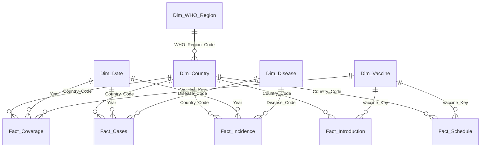

<div align="center">

# 💉 WHO Vaccination Data Analysis & Visualization

**End-to-end analytics platform for global immunization coverage, disease incidence, and vaccine introduction trends — built on 15+ years of WHO data.**

## 🚀 Live Demo

### 🌐 Streamlit Application
https://vaccination-data-analysis-and-visualization-vibxqle853xupnjfto.streamlit.app/

</div>

---

## 📌 Overview

This project turns WHO's raw global vaccination exports — coverage, incidence, disease cases, vaccine introduction, and immunization schedules — into two analytics products from one shared data model:

- A **multi-page Streamlit dashboard**, backed by SQLite, for interactive exploration and report downloads
- A **Power BI star schema** (5 dimensions + 5 facts) with 15 ready-to-use DAX measures, for BI-tool analysis

Built as part of the **LABMENTIX Bold Analytics Cohort 2025** internship program (Fintech/Data Science track), under INNOVEXIS.

<details>
<summary><b>Why this matters</b> — the question the project answers</summary>
<br>

Global vaccination coverage has been described by WHO as stalled or slipping in a meaningful share of countries since 2019, while several vaccine-preventable diseases have re-emerged in specific regions. This project makes that pattern explorable at the country, region, and disease level — instead of reading it as a single headline statistic — by joining coverage, case counts, incidence rates, and vaccine rollout timing in one model.

</details>

---

## ✨ Features

| Area | What it does |
|---|---|
| 🌍 **Global trends** | Coverage % and reported case trends over time, filterable by antigen, disease, and year |
| 🗺️ **World map** | Choropleth view of coverage/incidence by country, for any selected year |
| ⚖️ **Compare countries** | Side-by-side comparison of coverage, cases, and incidence across up to N countries |
| 📈 **Coverage vs. incidence** | Scatter analysis testing whether higher coverage tracks with lower disease incidence |
| 💊 **Vaccine introduction timeline** | When each vaccine was adopted, by country and WHO region |
| 📥 **Download reports** | Export filtered views as CSV/PDF directly from the app |
| 📊 **Power BI model** | Conformed star schema + DAX library for deeper BI-side analysis outside Streamlit |

---

## 🧱 Tech Stack

| Layer | Tools |
|---|---|
| Language | Python 3.11 |
| Data processing | pandas, NumPy |
| Storage | SQLite (`vaccination.db`) |
| Web app | Streamlit |
| Visualization | Plotly (app), Power BI + DAX (BI layer) |
| Environment | Anaconda, VS Code |

---

## 🗂️ Data Model

Star schema, conformed across all five WHO source extracts (coverage, cases, incidence, introduction, schedule):



<details>
<summary><b>Table grain & row counts</b></summary>
<br>

| Table | Grain | Rows |
|---|---|---:|
| `Dim_Country` | Country_Code (ISO-3) | 214 |
| `Dim_Date` | Year (2010–2023 primary range) | 84 |
| `Dim_Vaccine` | Vaccine_Key (Source_System \| Code) | 177 |
| `Dim_Disease` | Disease_Code | 13 |
| `Dim_WHO_Region` | WHO_Region_Code | 7 |
| `Fact_Coverage` | Country × Year × Vaccine × Coverage_Category | 381,041 |
| `Fact_Cases` | Country × Year × Disease | 82,054 |
| `Fact_Incidence` | Country × Year × Disease | 82,054 |
| `Fact_Introduction` | Country × Year × Vaccine | 138,321 |
| `Fact_Schedule` | Country × Year × Vaccine × Schedule_Round | 8,053 |

</details>

<details>
<summary><b>Key data-modeling decisions</b> (worth reading before extending this)</summary>
<br>

- **`group == 'COUNTRIES'` filter.** Coverage/Cases/Incidence source files mix real country rows with pre-aggregated rows (`WHO_REGIONS`, `GLOBAL`, `WB_LONG`, etc). Only country-level rows are kept as facts, so regional/global totals are computed by the BI/app layer instead of being double-counted.
- **`Vaccine_Key` composite key.** Coverage's `antigen` codes, Schedule's `vaccinecode`, and Introduction's free-text `description` are three different WHO vocabularies with almost no overlap. `Dim_Vaccine` is one conformed table tagged by `Source_System`, and each fact table relates only to its own segment — avoids silently mis-mapping vaccines across incompatible code lists.
- **Year-grain `Dim_Date`.** Source data carries no month/day, so this is a calendar-year dimension, not a full date table.
- **Coverage can exceed 100%.** This is a known WHO administrative-data artifact (denominator population estimates can undercount the true target group), not a cleaning bug — surfaced as-is with a note in both the app and the Power BI docs.

</details>

---

## 📊 Dashboard Pages

**Streamlit app** (`app.py`):

1. **Trends** — coverage & case trend lines, filterable by year/antigen/disease
2. **World Map** — choropleth of coverage or incidence for a selected year
3. **Compare Countries** — multi-select country comparison across all KPIs
4. **Download Reports** — export the current filtered view

**Power BI model** (`PowerBI_Data_Model_and_DAX.docx` + interactive HTML preview):

1. Global overview · 2. Coverage explorer · 3. Disease burden · 4. Coverage vs. incidence · 5. Vaccine introduction timeline · 6. Regional comparison

---

## 🧮 Power BI Deliverable

A `.pbix` can only be produced inside Power BI Desktop itself (proprietary binary format — no code path can generate one), so this project ships everything a `.pbix` would contain, pre-built from the real data:

| File | Purpose |
|---|---|
| `vaccination_model.db` | SQLite star schema — `Get Data → SQLite` in Power BI Desktop |
| `star_schema_csv.zip` | Same 10 tables as flat CSVs, for `Get Data → Folder` |
| `build_star_schema.py` | ETL script that produced both, re-runnable on the full-size source exports |
| `PowerBI_Data_Model_and_DAX.docx` | Exact relationships, 15 copy-paste DAX measures, dashboard-page spec |
| `vaccination_dashboard.html` | Standalone interactive preview of the intended Power BI pages (Chart.js, real data) |

<details>
<summary><b>Sample DAX measures</b></summary>

```DAX
Avg Coverage % =
AVERAGE ( Fact_Coverage[Coverage_Pct] )

Countries Below 80% Coverage =
CALCULATE (
    DISTINCTCOUNT ( Fact_Coverage[Country_Code] ),
    Fact_Coverage[Coverage_Pct] < 80
)

Cases YoY % Change =
VAR CurrentYear = [Total Reported Cases]
VAR PriorYear =
    CALCULATE ( [Total Reported Cases], SAMEPERIODLASTYEAR ( Dim_Date[Year] ) )
RETURN DIVIDE ( CurrentYear - PriorYear, PriorYear )
```

Full library of 15 measures (coverage KPIs, disease burden, coverage–incidence correlation, vaccine introduction, time intelligence) is in `PowerBI_Data_Model_and_DAX.docx`.

</details>

---

## ⚙️ Setup

```bash
# 1. Clone and enter the project
git clone <repo-url>
cd "Vaccination Data Analysis and Visualization"

# 2. Create environment
conda create -n vaccination-dashboard python=3.11 -y
conda activate vaccination-dashboard
pip install -r requirements.txt

# 3. Build the database from the cleaned WHO extracts
python generate_database.py

# 4. Run the Streamlit app
streamlit run app.py
```

Rebuilding the Power BI star schema instead of / in addition to the SQLite app database:

```bash
python build_star_schema.py
```

---

## 📁 Project Structure

```
Vaccination Data Analysis and Visualization/
├── app.py                          # Streamlit multi-page app
├── generate_database.py            # ETL: raw WHO CSVs -> SQLite (app database)
├── build_star_schema.py            # ETL: raw WHO CSVs -> Power BI star schema
├── vaccination.db                  # SQLite database (app)
├── vaccination_model.db            # SQLite database (Power BI star schema)
├── processed/
│   ├── coverage_cleaned.csv
│   ├── cases_cleaned.csv
│   ├── incidence_cleaned.csv
│   ├── intro_cleaned.csv
│   └── schedule_cleaned.csv
├── star_schema_csv/                # Flat CSV export of the 10 star-schema tables
├── PowerBI_Data_Model_and_DAX.docx # Relationships + DAX + dashboard spec
├── vaccination_dashboard.html      # Interactive Power BI-style preview
├── requirements.txt
└── README.md
```

---

## 🗺️ Roadmap

- [ ] Migrate `Dim_Date` to a full daily calendar table once monthly WHO extracts are available
- [ ] Add a resolved vaccine cross-reference between antigen / vaccinecode / description vocabularies
- [ ] Publish the Streamlit app to Streamlit Community Cloud
- [ ] Add drill-through from Global Overview → Country Deep-Dive in Power BI

---

## 👤 Author

**P Suman Sangeet**
Data Analytics Student · LABMENTIX Bold Analytics Cohort 2025 · INNOVEXIS Internship Program

---

## 📄 License

MIT — see [LICENSE](LICENSE) for details.

</div>
